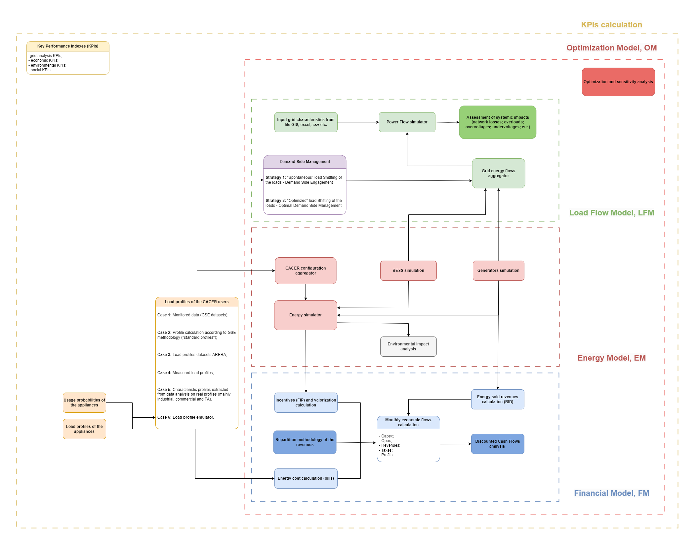

---

# CACER Simulator

This repository contains a simulation tool for assessing the **economic**, **financial**, and **energy** performance of renewable energy sharing configurations such as CACER (Configurations for Renewable Energy Sharing in Collective Self-Consumption).

## Description

The simulator supports the evaluation of different collective self-consumption scenarios, including Renewable Energy Communities (RECs) and Groups of Remote Self-Consumers. It provides detailed metrics such as:

- **Economic benefits**: savings and revenues from self-consumed and exported energy.
- **Financial indicators**: Payback Period, Net Present Value (NPV), and Internal Rate of Return (IRR).
- **Energy performance**: self-consumption levels, self-sufficiency, and CO₂ emissions reduction.

## Flow chart CACER simulator

<div style="text-align: center;">
  
</div>

## Repository Structure

- `assets/`: contains visual outputs or auxiliary resources.
- `files/`: input/output files and configuration data for simulations.
- `Functions_Load_Emulator_and_DSM.py`: functions for emulating the residential load profile and for simulating demand-side flexibility and management.
- `Functions_Energy_Model.py`: core energy modeling functions for CACER simulations (photovoltaic productivity simulation, load profile extraction, etc.).
- `Functions_Financial_Model.py`: functions for financial analysis and investment evaluation (Discounted Cash Flow analysis).
- `Functions_General.py`: general-purpose utility functions used throughout the project.
- `config.yml`: configuration file with key parameters for the simulations and path of file and forlders.
- `main - CACER tutorial.ipynb`: interactive Jupyter Notebook with step-by-step instructions for using the CACER simulator.
- `main - CACER.ipynb`: interactive Jupyter Notebook for using the CACER simulator (cleaned version, without tutorial).
- `main - load_profile_emulator.ipynb`: interactive Jupyter Notebook with step-by-step instructions for emulating domestic load profile.
- `Reporting.ipynb`: notebook to generate performance reports.
- `users CACER.xlsx`: example Excel file with user data.

## Prerequisites

You’ll need:

- Python 3.x
- Required libraries listed in `requirements.txt`

## Installation

1. Clone the repository:

   ```bash
   git clone https://github.com/ToniRollo/CACER-simulator.git

---

## 🔥 **New drop incoming!!**

## Main Functionalities

`🚨 PAY ATTENTION: ALL THE FOLLOWING FUNCTIONALITIES ARE ALREADY DEVELOPED IN THIS REPOSITORY AND HOW IT WORKS WILL BE EXPLAINED IN DETAIL LATER IN THIS SECTION `

### 1. Photovoltaic Productivity Simulator


`⏳ work in progress...`

`🚀 A tutorial main will be released later for this module!`

### 2. BESS Simulator


`⏳ work in progress...`

### 3. Load Profile Domestic Users Emulator

A domestic load profile emulator has been created that uses the load profiles of individual household appliances and their quarterly usage probabilities. The household appliances considered are:
- fridge;
- washing-machine;
- dish-washer;
- oven;
- microwaves;
- tv.
Additionally, a base load has been added in order to have a realistic aggregate load profile......

`⏳ work in progress...`

`🚀 A tutorial main will be released later for this module!`

#### 3.1. Demand Side Engagement Simulator

`⏳ work in progress...`

#### 3.2. Optimal Demand Side Management Simulator

`⏳ work in progress...`

### 4. Bills Simulator


`⏳ work in progress...`

### 5. Discounted Cash Flow Simulator


`⏳ work in progress...`

#### 5.1. Funding Scheme 

`⏳ work in progress...`

#### 5.2. Incentives Repartition Methodology

`⏳ work in progress...`

### 6. Grid Impact Simulator

`⏳ work in progress...`

`🚀 A tutorial main will be released later for this module!`

---

## Citations

### Pvlib citation

This project makes use of the [pvlib](https://github.com/pvlib/pvlib-python) library, which is licensed under the BSD 3-Clause License.

Copyright © 2013-2024, pvlib developers.

Redistribution and use in source and binary forms, with or without modification, are permitted provided that the following conditions are met:

1. Redistributions of source code must retain the above copyright notice, this list of conditions and the following disclaimer.
2. Redistributions in binary form must reproduce the above copyright notice, this list of conditions and the following disclaimer in the documentation and/or other materials provided with the distribution.
3. Neither the name of the pvlib organization nor the names of its contributors may be used to endorse or promote products derived from this software without specific prior written permission.

### Numpy Financial citation

This project uses [NumPy Financial](https://github.com/numpy/numpy-financial), which is licensed under the BSD 3-Clause License.

Copyright © NumPy Developers.

Redistribution and use in source and binary forms, with or without modification, are permitted provided that the following conditions are met:

1. Redistributions of source code must retain the above copyright notice, this list of conditions and the following disclaimer.
2. Redistributions in binary form must reproduce the above copyright notice, this list of conditions and the following disclaimer in the documentation and/or other materials provided with the distribution.
3. Neither the name of the NumPy organization nor the names of its contributors may be used to endorse or promote products derived from this software without specific prior written permission.

### Icons Attribution

Some icons used in this project are designed by Flaticon and are licensed under the Flaticon Basic License.

## License

BSD 3-Clause License

Copyright (c) [2025], [Aleotti Federico, Rollo Antonino/ RSE s.p.a.]
All rights reserved.

Redistribution and use in source and binary forms, with or without
modification, are permitted provided that the following conditions are met:

1. Redistributions of source code must retain the above copyright notice, this
   list of conditions and the following disclaimer.

2. Redistributions in binary form must reproduce the above copyright notice,
   this list of conditions and the following disclaimer in the documentation
   and/or other materials provided with the distribution.

3. Neither the name of the copyright holder nor the names of its
   contributors may be used to endorse or promote products derived from
   this software without specific prior written permission.

THIS SOFTWARE IS PROVIDED BY THE COPYRIGHT HOLDERS AND CONTRIBUTORS "AS IS"
AND ANY EXPRESS OR IMPLIED WARRANTIES, INCLUDING, BUT NOT LIMITED TO, THE
IMPLIED WARRANTIES OF MERCHANTABILITY AND FITNESS FOR A PARTICULAR PURPOSE ARE
DISCLAIMED. IN NO EVENT SHALL THE COPYRIGHT HOLDER OR CONTRIBUTORS BE LIABLE
FOR ANY DIRECT, INDIRECT, INCIDENTAL, SPECIAL, EXEMPLARY, OR CONSEQUENTIAL
DAMAGES (INCLUDING, BUT NOT LIMITED TO, PROCUREMENT OF SUBSTITUTE GOODS OR
SERVICES; LOSS OF USE, DATA, OR PROFITS; OR BUSINESS INTERRUPTION) HOWEVER
CAUSED AND ON ANY THEORY OF LIABILITY, WHETHER IN CONTRACT, STRICT LIABILITY,
OR TORT (INCLUDING NEGLIGENCE OR OTHERWISE) ARISING IN ANY WAY OUT OF THE USE
OF THIS SOFTWARE, EVEN IF ADVISED OF THE POSSIBILITY OF SUCH DAMAGE.
